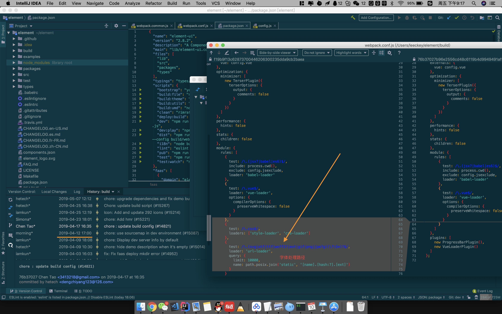

### 问题描述
​	更换电脑后，git clone项目代码yarn install之后，dev的时候字体图标是正常显示的，build测试版本后，release到测试服，项目中的字体图标不能显示，而且input组件中使用 ```v-model.number``` 修饰符后不能输入小数点。

### 分析查找原因

1. debug：通过network发现本地的字体请求地址为：

   ```http://localhost:31010/static/fonts/element-icons.535877f.woff```

   而测试服字体请求地址为：

   ```htpp://testhost:31010/static/css/static/fonts/element-icons.535877f.woff```

2. 思考：字体文件地址不对，但是项目关于element-UI配置自第一版发布后从未修改过。而且webpack配置也未更改，且开发的时候字体加载地址是正确的，应该是element-UI build的时候处理css中的字体出现了问题。然后去node_modules里的element-UI包排查，发现element-UI包的版本是号```"version": "2.8.2"```，而项目的package中element-UI版本号为```"element-ui": "^2.4.11"```，为什么安装的版本号不对呢？

3. 通过查询npm官方文档介绍[Caret Ranges ^1.2.3 ^0.2.5 ^0.0.4§](https://docs.npmjs.com/misc/semver.html#caret-ranges-123-025-004)学习到```"element-ui": "^2.4.11"```使用^符号范围会允许使用^2.4.11 := >=2.4.11 <3.0.0的版本。

4. 再通过分析element-UI github源码，git commit记录，查找到在4月12日，element-UI修改了css和font的loader配置，我们项目是在4月29日打包，期间element-UI发布版本中merged webpack config的修改。	

5. input组件使用```.number```修饰符后，不能输入小数的问题，是由于el-input组件**Input: simplify el-input implementation** ([**#13471**](https://github.com/ElemeFE/element/pull/13471))此次修改引起的。

### 解决问题
​	首先保证线上项目的稳定运行，避免版本升级带来的其他问题，我们决定回滚element-UI版本，去掉^符号范围，改用准确的```"element-ui": "2.4.11"```版本号。

​	修改完后yarn install重新build，项目恢复正常运行。

### 总结
​	以后在生产中，项目相关依赖尽量使用准确的版本号，避免生产中由于依赖包升级造成生产的风险，保证产品的稳定运行。
